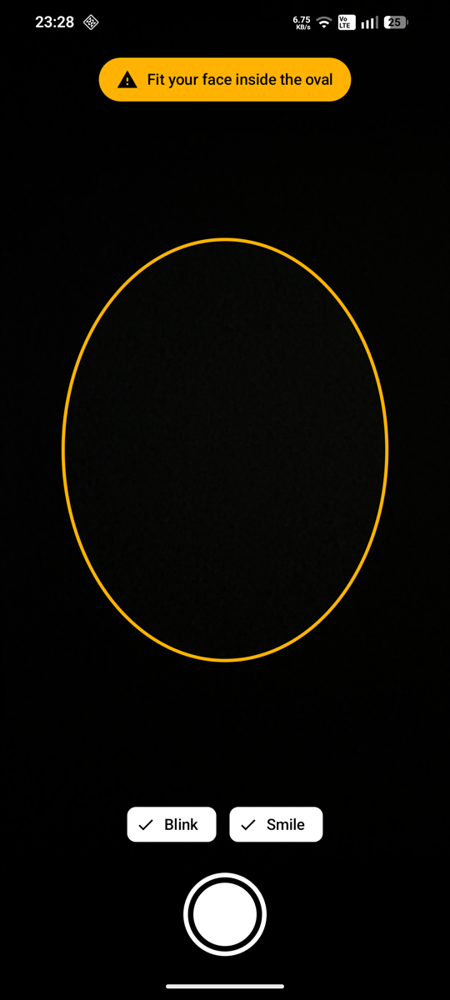

# Face Capture

An Android sample that takes a selfie for you when you blink or smile. It guides your face into an oval first,
warns you when part of your face is hidden, and lights your face with the screen when the room is dark.

It is built with Kotlin, Jetpack Compose, CameraX and on-device ML Kit face detection (contours, landmarks and
smile / eyes-open classification). The idea comes from the Firebase blog post
[ML Kit adds face contours](https://firebase.blog/posts/2018/11/ml-kit-adds-face-contours-to-create).



## What it does

- **Opens the front camera** as soon as the camera permission is granted.
- **Oval face guide.** The preview is dimmed outside an oval. A prompt at the top tells you one thing at a time:
  1. "Fit your face inside the oval"
  2. "Move left / right / up / down" (the preview is mirrored, so this is your own left and right)
  3. "Move closer" or "Move back a little"
  4. "Look straight at the camera"
  5. "Your mouth is hidden — please uncover it" (it names every hidden part)
  6. "Blink or smile to capture": the oval turns green
- **Auto-capture on blink.** Eyes open, then closed, then open again. Eyes held shut for over a second don't count.
- **Auto-capture on smile.** One photo per smile: it won't fire again until the smile has faded.
- **Only when you are in position.** Nothing is captured unless the face is centred, at the right distance, facing
  the camera and fully visible. Captures are at least 2 seconds apart.
- **Fill light in the dark.** When the ambient light sensor reads darkness, the area around the oval turns white and
  the screen goes to full brightness (for this window only; the system setting is untouched).
- **Blink / Smile toggles and a manual shutter button.**
- **Photos are saved to `Pictures/FaceCapture`** through MediaStore. No storage permission is needed.

Face detection runs on the device with ML Kit's bundled model, and the app's own code has no networking and asks
only for the `CAMERA` permission. The built app also carries `INTERNET` and `ACCESS_NETWORK_STATE`: ML Kit's
libraries add them for Google's usage and diagnostics reporting. See [NOTES.md](NOTES.md#permissions).

## Requirements

- Android 10 (API 29) or newer, with a front camera
- JDK 21 and the Android SDK with platform 37 (`compileSdk = 37`, `targetSdk = 36`)
- Gradle 9.8 (through the wrapper), AGP 9.4.1, Kotlin 2.4.20

## Build and run

Point `local.properties` at your Android SDK (Android Studio creates this file for you):

```properties
sdk.dir=/path/to/Android/sdk
```

Install on a connected device:

```bash
./gradlew :app:installDebug
```

Run the unit tests:

```bash
./gradlew :app:testDebugUnitTest
```

## How it is put together

```
app/src/main/java/com/azhar/facecapture/
├── MainActivity.kt          Activity, theme, camera-permission gate
├── face/
│   ├── FaceModels.kt        Shared pure-Kotlin model: FaceSample, Guidance, guideOval()
│   ├── FaceDetection.kt     ML Kit detector setup and Face -> FaceSample mapping
│   └── CaptureEngine.kt     Guidance + blink / smile detection (pure Kotlin)
└── ui/
    ├── CameraScreen.kt      CameraX wiring, prompt banner, capture, controls
    ├── FaceOverlay.kt       The oval, the dimmed / white surround, face contours
    └── AmbientLight.kt      Light sensor -> "is it dark" for the fill light
```

The data flow is one direction:

`LifecycleCameraController` → `MlKitAnalyzer` → `Face.toFaceSample()` → `CaptureEngine.onFrame()` →
`FrameResult` (guidance + optional trigger) → Compose UI, and a trigger → `takePicture()` into MediaStore.

A few choices worth knowing about:

- **`MlKitAnalyzer` with `COORDINATE_SYSTEM_VIEW_REFERENCED`** makes CameraX hand back face coordinates in
  `PreviewView` pixels, already scaled and mirrored. The overlay draws them as they are.
- **The oval is defined once**, in `guideOval()`. The overlay draws it and `CaptureEngine` measures the face against
  it, so what you see is what is checked.
- **`CaptureEngine` and `DarknessDetector` are pure Kotlin** with no Android imports, so the logic that decides when
  to prompt and when to capture runs in plain JVM unit tests (53 of them).

## Tuning

Everything that decides behaviour is a named constant.

| What | Where | Default |
|---|---|---|
| Oval size and position | `FaceModels.kt` | 72% of the width, 1.3 tall, centred at 45% of the height |
| Face size that fits the oval | `CaptureEngine.kt` | face box 0.6 to 1.1 of the oval width |
| How far off-centre is allowed | `CaptureEngine.kt` | 15% of the oval's width / height |
| Head turn / tilt limit | `CaptureEngine.kt` | 18° yaw, 20° pitch |
| Eyes open / closed | `CaptureEngine.kt` | open ≥ 0.7, closed ≤ 0.3, closed for at most 1 s |
| Smile | `CaptureEngine.kt` | ≥ 0.8 for 2 frames; re-arms below 0.3 |
| Time between captures | `CaptureEngine(cooldownMs)` | 2 s |
| Dark / bright thresholds | `AmbientLight.kt` | dark below 10 lux, bright from 60 lux |

## Limits

- **"Part hidden" is approximate.** ML Kit often still reports a landmark for a covered part. The app also treats
  an eye or the mouth as hidden when ML Kit can't classify it, which catches many cases but not all. Parts outside
  the frame are caught reliably.
- **One face at a time.** With contours enabled, ML Kit only outlines the most prominent face.
- **Tested on one phone** (see [NOTES.md](NOTES.md) for what was and wasn't verified).
- **English only.** UI strings are inline, not in string resources.
- **No in-app gallery yet.** Tapping the thumbnail opens the photo in whichever gallery app the phone has.

## More

[NOTES.md](NOTES.md) has the findings from building this: how ML Kit behaves with contours and classification
together, the measurements behind the fill light, what has been tested, and what's planned.
